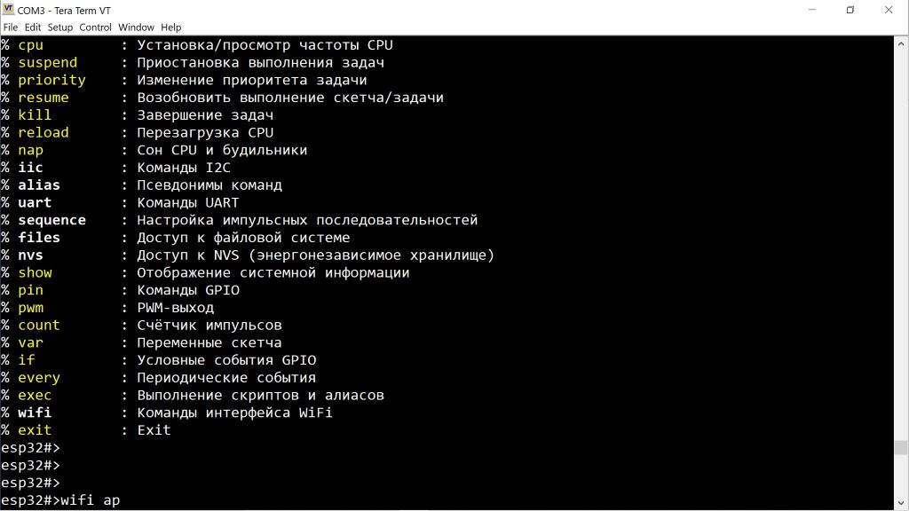

# ЧТО ЭТО ТАКОЕ

Это инструмент для отладки и разработки (библиотека для фреймворка Arduino), предназначенный для использования с **оборудованием ESP32**.

Он предоставляет интерфейс командной строки (CLI, прозрачно поддерживает UTF-8) через последовательный порт (UART или USB), работающий параллельно с вашим скетчем Arduino. Это **не** самостоятельная программа — инструмент встраивается в скетч на этапе компиляции и расширяет любой скетч (даже пустой) оболочкой. ESPShell также позволяет приостанавливать и возобновлять выполнение скетча.

Пользователь может вводить и выполнять команды (множество встроенных), аналогично работе с командной строкой в Linux, пока скетч продолжает выполняться. ESPShell работает как с монитором порта в Arduino IDE, так и с другими терминальными программами, такими как *PuTTY* или *Tera Term*. Пользователи Linux могут выбрать любой терминал — даже утилита `cu` подойдёт.

Эта библиотека будет полезна:

1. **Разработчикам**, работающим с устройствами I2C, WiFi или UART. ESPShell предоставляет команды для создания/удаления интерфейсов, отправки/приёма данных и пр.  
   Примеры:
   - Работа с UART-устройствами, такими как GPS-модули или GSM-модемы  
   - Разработка библиотек для I2C-устройств  
   - Тестирование/отладка плат с реле одной командой  
   - Просмотр и изменение переменных скетча  
   - Изменение параметров пинов или интерфейсов (например, скорости UART или режима подтяжки пина) на лету — больше не нужно пересобирать и перепрошивать проект при каждой ошибке

2. **Новичкам**, которые хотят поэкспериментировать с «железом», не написав ни строчки кода

3. **Производителям Arduino-совместимых плат**. Предустановленная оболочка может использоваться:
   - Для тестирования на производстве  
   - Для демонстрации возможностей платы без необходимости писать код  
   - Для реализации примеров вроде мигания светодиодом или управления реле только с помощью команд ESPShell

---

# КАК УСТАНОВИТЬ

Библиотека доступна через **Arduino Library Manager**:

1. Откройте **Library Manager**
2. Введите `espshell` в строке поиска
3. Выберите последнюю версию и нажмите **Install**

**Чтобы установить вручную** (например, последнюю версию с GitHub):

Вариант#1:
1. Скопируйте содержимое папки /src (27 или около того файлов) в каталог со своим скетчем.

Вариант#2:
1. Создайте папку: `/YourSketchBook/libraries/espshell`  
2. Скопируйте содержимое библиотеки (`/docs`, `/src`, `/examples` и т.д.) в эту папку  
3. Перезапустите Arduino IDE

---

# КАК ИСПОЛЬЗОВАТЬ В СВОЁМ ПРОЕКТЕ?

1. Добавьте `#include "espshell.h"` в свой скетч  
2. Скомпилируйте и загрузите, как обычно  
3. Откройте монитор порта, введите `?` и нажмите **Enter**

> **ПРИМЕЧАНИЕ:** Монитор порта в Arduino IDE — не лучший выбор. Лучше использовать отдельную терминальную программу, например **Tera Term**.

---

# МОЖНО ЛИ ВЫПОЛНЯТЬ КОМАНДЫ ОБОЛОЧКИ ИЗ СКЕТЧА?

Да. Используйте функцию **`espshell_exec()`**, которая выполняет произвольную команду (или несколько команд) оболочки.  
Можно передавать несколько команд за один вызов, разделяя их символами новой строки.  
Функция асинхронная — она возвращает управление сразу.

Чтобы проверить, завершилось ли выполнение команды, используйте **`espshell_exec_finished()`**.

---

# КАКОЙ ОБЪЁМ ПАМЯТИ ИСПОЛЬЗУЕТ ESPSHELL?

Последняя проверенная версия из GitHub имела следующие накладные расходы:

- **Размер кода (бинарника):** +100 КБ  
- **Размер данных (data + BSS):** +2.5 КБ  
- Небольшая часть кода (~512 байт) размещается в IRAM (`IRAM_ATTR`) и постоянно находится в оперативной памяти

ESPShell выполняется на втором ядре (в многопроцессорных системах), чтобы минимизировать влияние на основной скетч.

Можно ли еще уменьшить накладные расходы? [Конечно!](https://vvb333007.github.io/espshell/html/Customizing.ru.html)

---

# ДОКУМЕНТАЦИЯ

- English:  
  [ESPShell Documentation (EN)](https://vvb333007.github.io/espshell/html/index.html)

- На русском:  
  [ESPShell Documentation (RU)](https://vvb333007.github.io/espshell/html/index.ru.html)

---

# РАЗРАБОТКА ESPSHELL

ESPShell написан на чистом C. Он прост для понимания, удобен для разработчиков и хорошо прокомментирован.

Некоторые участки кода помечены как **`TODO:`**. Дополнительная информация — в файлах:

- `docs/PROBLEMS.txt`  
- `docs/PLANS.txt`

Код в целом простой и линейный. Неочевидные участки сопровождаются комментариями.  
Обратите внимание, что автор не является носителем английского языка, поэтому в комментариях могут встречаться ошибки и языковые неточности.
